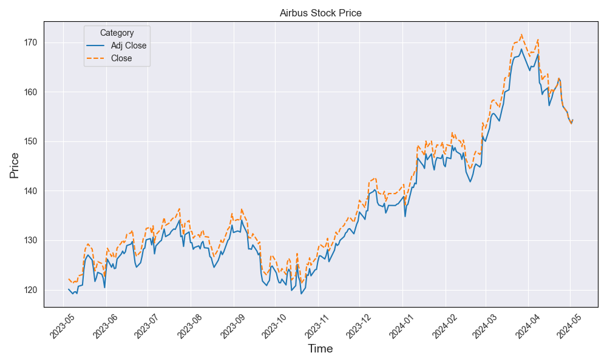

+++
title = 'Market Bullet Movements 05/05/24'
date = 2024-05-05T17:07:19+01:00
draft = false
+++

### Amazon’s Cloud Dominance Continues: 
Amazon Web Services (AWS) showcased an impressive performance with a **17% year-on-year sales increase, totaling $25 billion** in the first quarter of 2024. This marks a significant acceleration in AWS's growth trajectory, reinforcing its leadership in the cloud computing sector.

### Pharmaceutical Sector Highlights: 
Novo Nordisk's Wegovy, a leading weight-loss drug, has propelled the company to become one of Europe’s most valued pharmaceutical firms. In a robust start to the year, drug developers have **successfully raised $6.2 billion** through U.S. equity capital markets as of January 2024. Additionally, Japan’s sovereign development bank has made a notable investment in UK life sciences through 4 Bio Capital. This venture fund is well-regarded for its support of advanced treatments, including cell and gene therapies.

### Berkshire Hathaway Update: 
Warren Buffett has significantly reduced Berkshire Hathaway's position in Apple, **selling 13% of its stake just before Apple's anticipated $100 billion buyback**. Buffett suggested that the divestiture was motivated by tax strategies, aiming to lock in substantial profits and preemptively reduce future tax burdens in anticipation of potential tax rate increases to manage the U.S.'s expanding fiscal deficit.

## Weekly Stock Pick - Airbus SE

Airbus has continued to strengthen its market position across its diverse portfolio, which includes commercial aircraft, defense and space, and helicopters. Despite facing a slight decrease in profit margins, the aerospace giant reported a substantial **revenue increase of 11% year-over-year**, achieving **€65.4 billion and surpassing market expectations**. The adjusted operating profit saw a modest rise to €5.8 billion. Notably, Airbus's order intake surged dramatically to €186.5 billion, significantly enhancing its backlog to €554 billion from €449 billion previously, signaling robust future revenue streams. The company's financial health remains solid, with **net cash positions exceeding €10 billion, accompanied by a special dividend payout of €1.00 per share**.

Airbus's competitive edge is particularly evident in the narrow-body segment, where it continues to outperform Boeing. However, challenges remain in the wide-body segment, with strategic focuses on improving the A350 program towards breakeven. Despite potential concerns over sustainability in air travel, Airbus is poised to capitalise on emerging opportunities in developing eco-friendly propulsion technologies.

