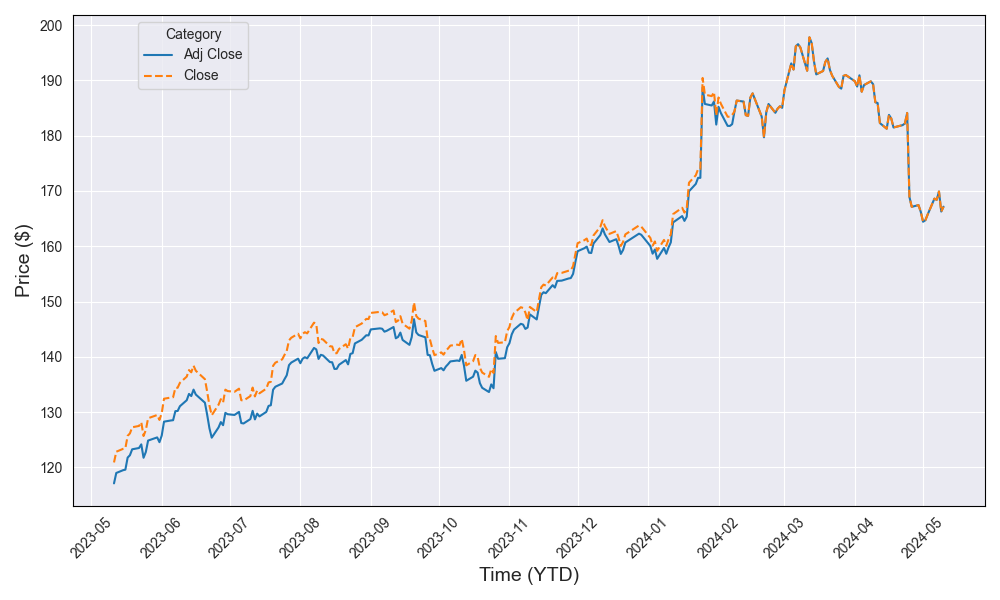

+++
title = 'Market Bullet Movements'
date = 2024-05-13T17:07:19+01:00
draft = false
+++

### Latest Market News and Highlights

**Chinese Bond Market Activity**
Chinese authorities have initiated the sale of ¥1 trillion ($140 billion) in long-dated bonds. This move aims to enhance liquidity in the market for longer-term Chinese bonds. 

**Foreign Exchange Hedging Amid Geopolitical Risks**
In the context of increasing geopolitical risks and diverging economies, hedging foreign exchange exposure has become increasingly crucial for global investors.

**UK Economic Developments**
The UK GDP has grown by 0.6%. Analysts anticipate the Bank of England will reduce interest rates from the current 5.25%, a 16-year high, with two rate cuts expected by December. This comes amidst an easing of inflation, contrasting with the US Federal Reserve's maintenance of high interest rates driven by robust US economic growth.

**BRICS and Dollar Dominance**
BRICS nations are in discussions on strategies to reduce their reliance on the US dollar, seeking alternatives to assert greater financial independence.

**Investment in Autonomous Driving Technology**
UK-based Wavye has successfully raised $1 billion in investor capital to advance its autonomous driving technology.

**US Foreign Relations and Trade Policies**
- US President Biden plans to halt weapon supplies to Israel to prevent a full-scale invasion of Rafah.
- The US has imposed 100% tariffs on Chinese electric vehicles (EVs) to protect domestic EV manufacturers, with a strategy to outsource production to Europe.
- China's President has made his first visit to Europe since the COVID-19 pandemic began, focusing on strengthening ties with Hungary.

### IBM First Quarter Results

**Company Overview**
IBM operates in the software, cloud infrastructure, and platforms industry. The company's focus is on the hybrid cloud and AI sectors, providing extensive technology and business expertise. IBM has recently been divided into two entities: IBM and Kyndryl.

**Financial Performance**
- **LTM Financials**: IBM reported revenue of $61.860 billion for the twelve months ending December 31, 2023, marking a 2.2% year-over-year increase.
- **First Quarter Highlights**: The company achieved a revenue of $14.5 billion, a 1% increase overall and a 3% increase at constant currency.
- **Market Cap and Valuation**: IBM has a market cap of $153.544 billion and an enterprise value of $196.53 billion. The LTM EV to Revenue ratio stands at 3.18, with an EV/EBITDA ratio of 12.3 as of May 12, 2024.

**Strategic Acquisition**
IBM has announced its intention to acquire HashiCorp, Inc. for $35 per share in cash, representing an enterprise value of $6.4 billion. This acquisition aims to enhance IBM's hybrid cloud platform, positioning it strongly for the AI era.

IBM continues to strategically invest and expand its capabilities in key growth areas, reinforcing its leadership in the evolving technology landscape.