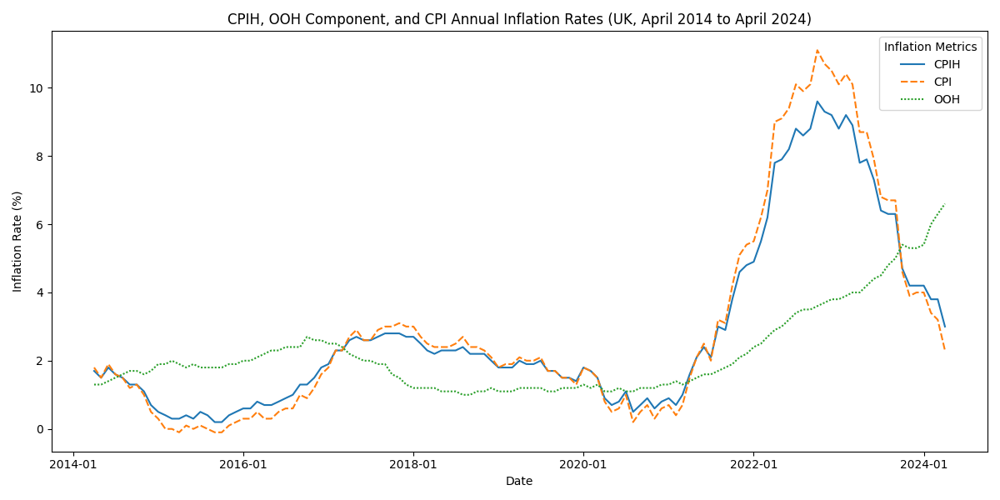

+++
title = 'Interest & Inflation Rates'
date = 2024-05-19T17:07:19+01:00
draft = false
+++

### Market News

**Raspberry Pi IPO:** The British manufacturer of low-cost computer modules for industrial applications is planning to list on the London Stock Exchange. This move highlights the increasing market interest in affordable computing solutions.

**US Inflation Update:** US inflation has decreased to 3.4%, aligning with economists' predictions. This development has spurred investors to increase their bets on potential cuts to Federal Reserve interest rates. Notably, the inflation data from April last year will be phased out this week. With the upcoming release of May's inflation data, a further drop in overall inflation rates is anticipated.

### Understanding Interest Rates

**What is an Interest Rate?**  
The interest rate represents the cost of borrowing money. It can be defined as the rate at which commercial banks lend to each other or the rate at which banks borrow from the central bank.

**Effects of Interest Rate Adjustments:**
- **Increase:** Makes borrowing costlier, leading to reduced consumer spending and investment.
- **Decrease:** Reduces loan costs, potentially boosting spending and investment.

Interest rates significantly influence foreign exchange values. Higher rates offer better returns on savings and investments, attracting capital and increasing demand for the currency, thereby appreciating its value. Conversely, lower rates diminish returns, possibly driving capital elsewhere and depreciating the currency.

### What is Inflation?

Inflation measures how much the prices of goods and services rise over time, reducing purchasing power. The central bank uses the Consumer Price Index (CPI) to track and manage inflation rates. See the CPI hisotry plot below which shows how CPI has changed over the coure of the decade.

High inflation generally weakens a currency because it erodes purchasing power, making domestic goods more expensive and less attractive to foreign investors. Conversely, lower inflation can enhance a currency's value and attract more investment.

### Why Aim for 2% Inflation?

A 2% inflation rate is often targeted to balance economic stability and growth. It provides a cushion against deflation, which can lead to economic stagnation, and allows flexibility for policy adjustments during economic downturns. The Federal Reserve now employs a flexible form of average inflation targeting to moderate the effects of fluctuating inflation rates.

### Forex and Economic Indicators

**Summary:**
- **Interest Rates:** Determine borrowing costs and influence currency value through capital flows.
- **Inflation:** Affects the overall economic health and investor perceptions, impacting currency strength.
- **Forex Trading:** Can be conducted through various instruments like spread bets, CFDs, or direct trades using forwards and options.

This concise overview provides a snapshot of current market conditions and fundamental economic concepts affecting forex markets. Stay tuned for more detailed analyses in future posts.
