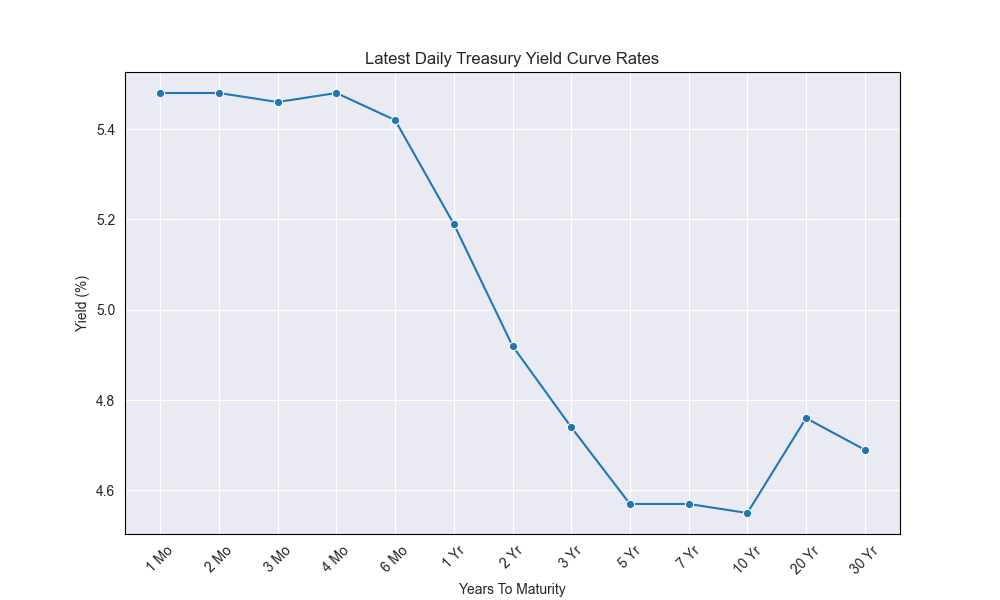

+++
title = 'Inverted Yield Curves'
date = 2024-05-26T22:59:19+01:00
draft = false
+++

### Market Update: Statistics
Stay updated on the current market dynamics and key financial indicators that influence global economics and investment strategies.

| Asset           | Current Value/Rate   |
|-----------------|---------------------|
| S&P 500         | 5,196.91            |
| DJIA            | 3811.48             |
| Crude Oil       | $77.91              |
| Gold            | $2344.00            |
| 3M UST          | 5.39%               |
| 6M UST          | 5.36%               |
| 2 yr UST        | 4.95%               |
| 5 yr UST        | 4.58%               |
| 10 yr UST       | 4.5590%             |
| 30 yr UST       | 4.68%               |

### Recent News

**Currency Peak**: The pound-to-euro exchange rate has reached its highest level in two years, indicating a significant shift in currency values.

**Bond Market Shifts**: Recent U.S. government bond auctions saw lower-than-expected demand, leading to a decrease in treasury prices and a rise in yields. This could result in higher borrowing costs and potentially slow economic growth due to increased lending rates.

**Corporate Acquisition**: International Distribution Services, the company that owns Royal Mail, has been acquired by a Czech billionaire, marking a notable change in ownership.

**Legal Verdict**: Donald Trump was found guilty on all 34 counts in his New York ‘hush money’ case, a major legal and political development.

**Inflation Rates Steady**: US inflation remained at 2.7% for the year to April, aligning with the Federal Reserve's target, indicating stable but persistent price pressures.

**Inflation Concerns in Europe**: In a concerning development for investors, Eurozone inflation increased to 2.6%, marking the first rise this year and dampening hopes for aggressive interest rate cuts by the ECB.

**Government Divestiture**: The UK government has reduced its stake in NatWest to under 23%, accelerating its exit from the bank amidst electoral pressures that have stalled public share sale plans.

**Major Sale in Saudi Arabia**: Saudi Arabia plans to sell approximately $12 billion in shares of Saudi Aramco, aiming to boost capital for its sovereign wealth fund in a significant financial move.

### Understanding Yield Curves

The **bond yield** is the annual return an investor earns from holding a bond until its maturity. There exists an inverse relationship between the price of a bond and its yield: as the price of a treasury increases, its yield decreases due to heightened demand, leading to lower interest rates.

Consider a bond issued by Company A with a $1000 face value, a 2-year maturity, and a 10% coupon rate with semi-annual payments. Initially priced at $1000, if interest rates rise to 15%, the bond's market price will drop below $1000 as newer issues offer higher returns. Conversely, if interest rates drop to 5%, the bond's value will increase above $1000 since it offers a higher return compared to new issues.

A **zero-coupon bond** promises to pay its face value at maturity without any interim coupon payments.

### Current Yield Curve Analysis

A yield curve is a graph showing the interest rates of bonds of equal credit quality but varying maturity dates. It is an essential tool for assessing economic outlook. Investors confident about the economy might opt for riskier assets, leading to a rise in long-term bond yields due to reduced demand. Currently the rates on medium and long-term treasury securities have risen, while short-term yields have remained stable, see figure below. This inversion is primarily driven by recent Federal Reserve interest rate hikes, with short-term yields closely tracking the increased federal funds rate.

### Types of Yield Curves
- **Normal Yield Curve:** Longer-term bonds have higher interest rates than shorter-term bonds, reflecting the greater risk of long-term investments.
- **Inverted Yield Curve:** Short-term bonds yield more than long-term bonds, indicating concerns about the near-term economic outlook.
- **Flat Yield Curve:** Similar yields for short and long-term bonds suggest that the economy may be transitioning between growth and recession phases.

### Impact on the Fixed Income Market

- **Interest Rate Risk:** Rising yields cause existing bonds to depreciate as new bonds offer higher returns.
- **Bond Valuation:** The yield curve is crucial for setting interest rates, which plays a vital role in bond pricing and portfolio management.
- **Economic Indicators:** Yield curves can indicate economic trends; a steepening curve suggests expected economic growth and inflation, while a flattening curve may indicate an economic slowdown.

#### Yield Curve Movements Terminology
- **Bear Steepening:** A scenario where interest rates are increasing, making the yield curve steeper.
- **Bear Flattening:** Occurs when rising interest rates lead to a flatter yield curve.
- **Bull Steepening:** When interest rates decrease, leading to a steeper yield curve.
- **Bull Flattening:** Interest rates are decreasing, resulting in a flatter yield curve.